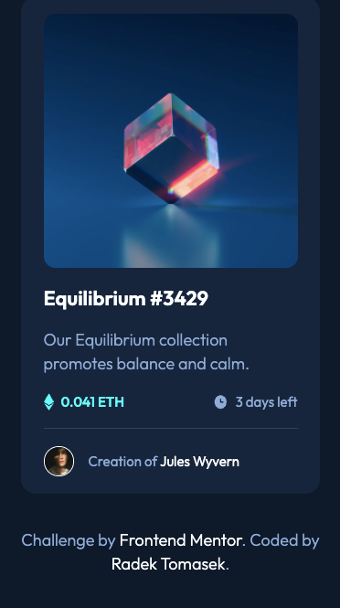
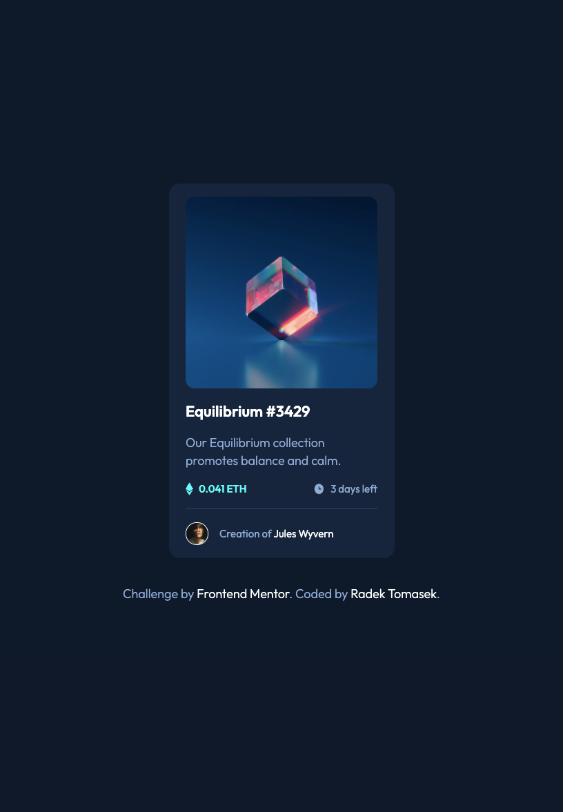
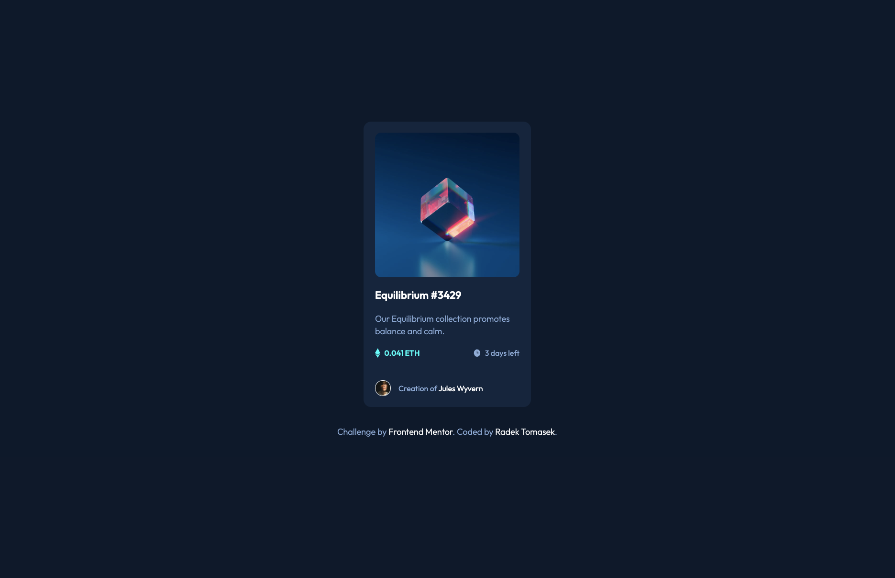

# NFT preview card component

This repository contains an implementation of one of the Frontend Mentor Challenges - [NFT preview card component](https://www.frontendmentor.io/challenges/nft-preview-card-component-SbdUL_w0U) using HTML/CSS.

### The Challenge

This challenge ([NFT preview card component](https://www.frontendmentor.io/challenges/nft-preview-card-component-SbdUL_w0U)) was the sixth one I picked from the [Frontend Mentor](https://www.frontendmentor.io) and structurally it was very similar to the previous one - [QR Code Component](https://github.com/radektomasek/fm-qr-code-component)

I again chose the approach of using Vanilla CSS alongside the CSS variables. There were some specific challenges, the image hover state in particular, but in general it was still a very straighforward implementation.

Let me break things up in the next few paragraphs.

### Screenshots

There are a few screenshots captured within the various screen sizes.

#### Mobile Version

This is the **mobile version** as displayed on **iPhone SE**.

#### Tablet Version

This is the **tablet version** as displayed on **iPad Air**.

#### Desktop Version

This is the **desktop version** as displayed on a large screen.

### Links

- Solution URL: [https://github.com/radektomasek/fm-qr-code-component](https://github.com/radektomasek/fm-qr-code-component)
- Live Site URL: [https://radektomasek.github.io/nft-preview-card-component](https://radektomasek.github.io/nft-preview-card-component)

## My process

Building [this challenge](https://www.frontendmentor.io/challenges/nft-preview-card-component-SbdUL_w0U) was another cool experience. Despite the fact that it was quite similar to the previous one - [QR Code Component](https://github.com/radektomasek/fm-qr-code-component), it was definitely a bit more challenging.

I started structuring the layout focusing on mobile first approach. As all of the challenges, I had completed so far, are ranked with newbie difficulty, the completion of the basic layout didn't take too long for me.

The most time consuming part was making sure the hover effects were covered as precisely as possible. There was a special eye svg icon which I initially put as a background image, but things didn't look quite right especially as transparency was applied too. Fortunately, I was able to catch up with my colleague who is a CSS expert, and he gave me some ideas how to solve it in a better way.

### Built with

- Semantic HTML5 markup
- Mobile-first workflow
- [Parcel](https://parceljs.org) - a simple, zero config builder

### What I learned

In this particular challenge, the biggest learning thing for me was realizing that I **couldn't apply CSS variables to the media query condition** in vanilla CSS. In the production code, I generally use things like SASS or Tailwind and never actually realized [this thing is not supported](https://bholmes.dev/blog/alternative-to-css-variable-media-queries).

On the other hand, using CSS variables inside of a media query is perfectly fine and it helped me to simplify the code quite a bit. Instead of declaring a lot of specific variables for various screen sizes, I could easily define the CSS variables on the `main :root level/inside a :root wihtout media qery breakpoints` and let them be overridem based on the viewport sizes.

### Continued development

I still need to dig more into advanced CSS methodologies like Cube CSS.

## Author

- Frontend Mentor - [@radektomasek](https://www.frontendmentor.io/profile/radektomasek)
- Linkedin - [radektomasek](https://www.linkedin.com/in/radektomasek)
- Twitter - [@radek_tomasek](https://twitter.com/radek_tomasek)
